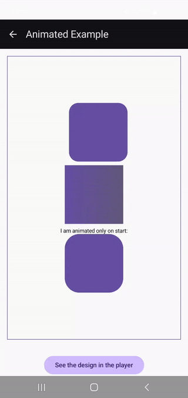

# Animated Example

An animated example that shows how to do basic time-dependent animations and entry animations. It showcases the use of time constants (here,
**RemoteFloat(Rc.Time.CONTINUOUS_SEC)**) to animate corner, offset and gradient offset. It also showcases _animateRemoteFloat_.

 Animated Example

_Some notes_:
- It seems using a **RemoteLinearGradient** brush with the modifier _background()_ prevents some other modifiers from working (in this example, _clip()_ and _offset())_ were not working).
- Passing a mutable **RemoteFloat** to _animateRemoteFloat_ jumps to the end of the animation without animating, so a constant was passed instead for now.