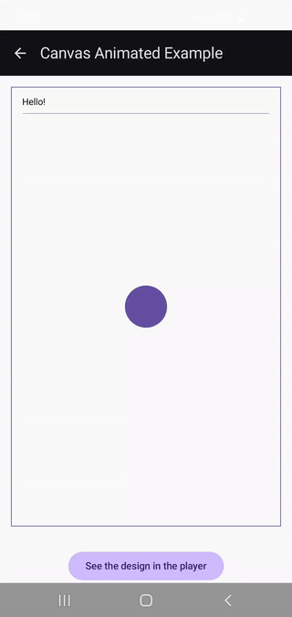

# Canvas Animated Example

An animated example that shows how to do basic time-dependent animations and entry animations in **RemoteCanvas**.

 Canvas Animated Example

_Some notes_:
- _drawAnchoredText_ was used here to not have to rely on the text's size, unlike in the simpler example.
- The function _inset_ is not yet available, so the workaround now was to rely on _translate_ and _clipRect_.