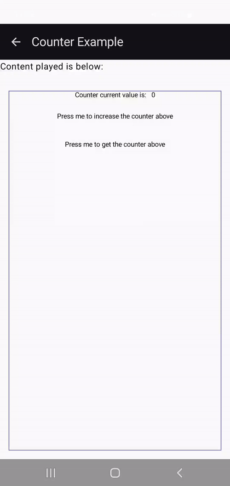

# Counter Example

An example that shows an updatable counter. It showcases the use of a mutable **RemoteInt** with _rememberMutableRemoteInt_, and displays it.

 Counter Example

_Some notes_:
- There is a bug with RemoteText (as of version 1.0.0-alpha07): the default color used is different between overloads; the version that takes a **String** uses Black, and the version that takes a **RemoteString** uses White (fallback).
- Because of the current limitation of _.toRemoteString()_, you need to pass in the number of digits to render, and it will render with spaces on the left (using the flags messed up some numbers, like 10).
