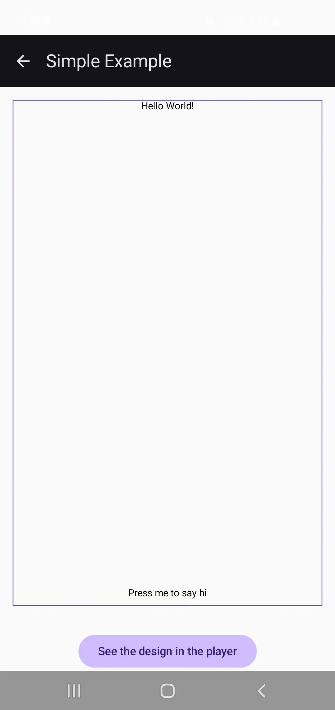
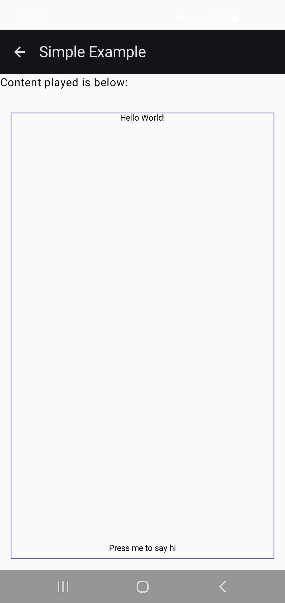

# Simple Example

A simple working example is provided (in the package _examples_, the classes are **RemoteCreatorPage** and **RemotePlayerPage**).
It showcases the following in the creator: **RemoteColumn**, **RemoteText** and **RemoteSpacer** (with weight 1), and showcases how to use a RemotePlayer:

|  Simple Example Creator |  Simple Example Player |
|:--------------------------------------------------------------------------------:|:-----------------------------------------------------------------------------:|

