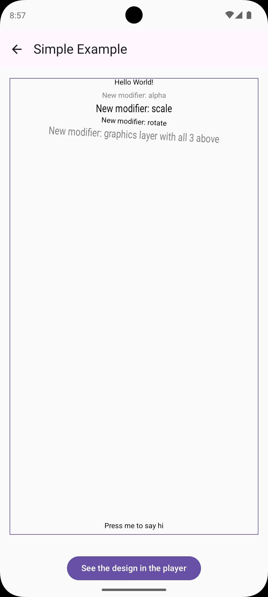
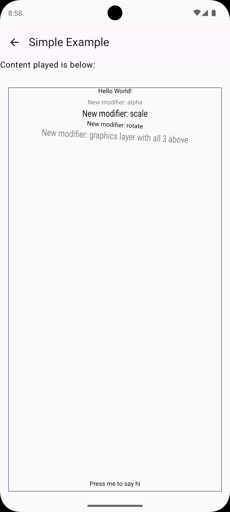

# Simple Example

A simple working example is provided (in the package _examples_, the classes are **RemoteCreatorPage** and **RemotePlayerPage**).
It showcases the following in the creator: **RemoteColumn**, **RemoteText** and **RemoteSpacer** (with weight 1), and showcases how to use a RemotePlayer:

|  Simple Example Creator |  Simple Example Player |
|:--------------------------------------------------------------------------------:|:-----------------------------------------------------------------------------:|

- _from library version 1.0.0-alpha11_: new modifiers __alpha__, __rotate__ and __scale__, are showcased.

_Some notes_:
- It seems using more than 1 of the modifiers __alpha__, __rotate__ and __scale__, is not working as of version _1.0.0-alpha11_,
as only the last modifier applied will win.